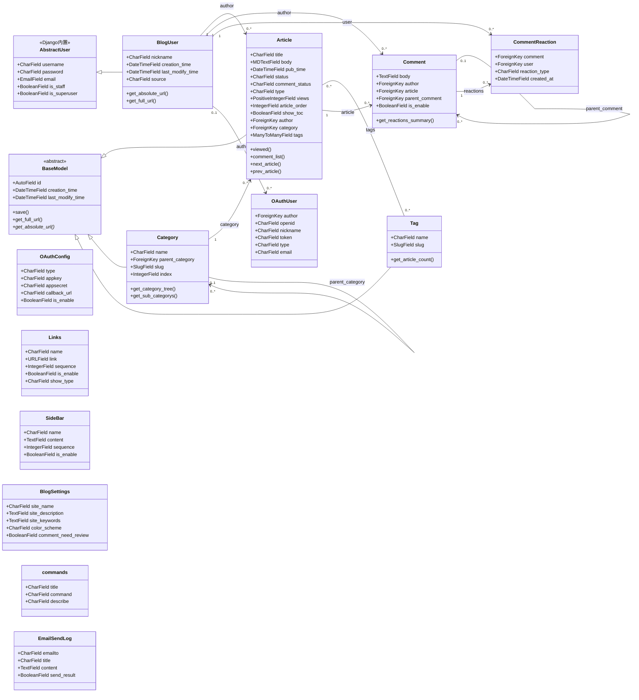
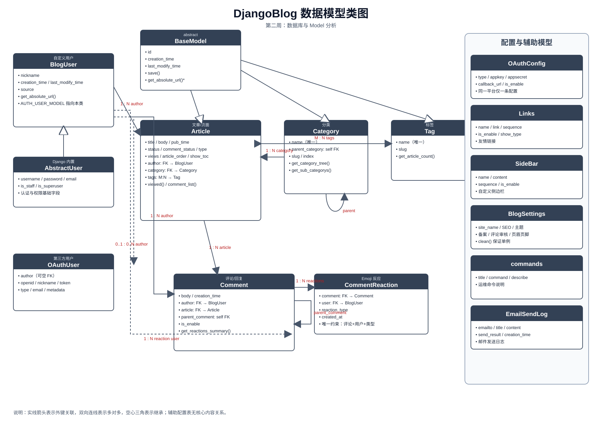
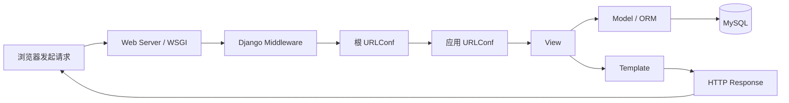

# 第二周：数据模型与 Django 架构分析

## 1. 任务说明

本周围绕 DjangoBlog 项目完成三项工作：

1. 分析项目数据库配置和各个 Django app 中的 `models.py`；
2. 使用 UML 类图建模系统的数据模型，说明模型之间的继承、关联和多对多关系；
3. 结合项目源码说明 Django 的 MTV 架构和一次请求的处理流程，并对核心源码进行注释。

本文档以项目源码为依据，不代表线上数据库的实时快照。数据库结构最终由 Django migration 和实际运行时的 `migrate` 命令生成。

## 2. 项目与数据库概况

### 2.1 技术栈

- 后端框架：Django 5.x
- 编程语言：Python 3.10+
- 默认数据库：MySQL，字符集为 `utf8mb4`
- 缓存和搜索：Redis、Whoosh/Elasticsearch，可按配置启用
- 前端技术：Alpine.js、Tailwind CSS、HTMX、Vite
- 内容编辑：Markdown，对应 `mdeditor` 字段

### 2.2 数据库配置

数据库配置位于 `src/djangoblog/settings.py` 的 `DATABASES` 中：

- 默认数据库名为 `djangoblog`；
- 默认使用 MySQL 后端；
- 主机和端口默认为 `127.0.0.1:3306`；
- 数据库名、用户、密码、主机和端口都优先从环境变量读取；
- 使用 `utf8mb4` 以支持中文和 Emoji 字符。

因此，代码分析时可以通过 `models.py` 还原数据模型，部署时则通过环境变量切换数据库连接信息，而不应把生产密码写入报告或 Git 仓库。

### 2.3 ORM 与数据库表

Django ORM 将 Python 模型映射为数据库表：

- 一个普通模型类通常对应一张数据表；
- 一个 `ForeignKey` 通常对应一个外键字段；
- 一个 `ManyToManyField` 会额外生成中间关系表；
- 抽象模型 `BaseModel` 只提供公共字段，不单独生成表；
- Django 内置的认证、权限、会话、站点和迁移记录也会生成对应的系统表。

## 3. 模型角色划分

| app | 核心模型 | 职责 | 主要关系 |
|---|---|---|---|
| accounts | `BlogUser` | 统一用户和作者信息 | 继承 `AbstractUser`，是文章、评论等模型的外键目标 |
| blog | `BaseModel` | 业务模型抽象基类 | 被 `Article`、`Category`、`Tag` 继承 |
| blog | `Article` | 文章或独立页面 | 关联用户、分类，并与标签多对多 |
| blog | `Category` | 文章分类树 | 自关联形成父子分类，与文章一对多 |
| blog | `Tag` | 文章标签 | 与文章多对多 |
| blog | `Links` | 友情链接 | 独立配置表 |
| blog | `SideBar` | 侧边栏内容 | 独立配置表 |
| blog | `BlogSettings` | 网站全局配置 | 单例配置表 |
| comments | `Comment` | 文章评论和回复 | 关联用户、文章，自关联父评论 |
| comments | `CommentReaction` | 评论 Emoji 反应 | 关联评论和用户 |
| oauth | `OAuthUser` | 第三方登录用户映射 | 可绑定到 `BlogUser` |
| oauth | `OAuthConfig` | OAuth 平台配置 | 独立配置表 |
| servermanager | `commands` | 运维命令说明 | 独立辅助表 |
| servermanager | `EmailSendLog` | 邮件发送日志 | 独立日志表 |

## 4. UML 数据模型类图



类图中的 `*` 表示抽象方法，需要由具体子类实现。

类图同时提供以下文件：

- `doc/diagrams/数据模型类图.svg`：可直接查看的图片；
- `doc/diagrams/数据模型类图.mmd`：Mermaid 源文件；
- `doc/diagrams/数据模型类图.puml`：PlantUML 源文件。



`Links`、`SideBar`、`BlogSettings`、`OAuthConfig`、`commands` 和 `EmailSendLog` 是配置或日志类，不依赖文章核心关系，但在数据库设计中仍属于实际业务表。

## 5. 核心模型关系和约束

### 5.1 用户模型

`BlogUser` 继承 Django 的 `AbstractUser`，因此保留用户名、密码、邮箱、权限和后台登录能力，同时增加：

- `nickname`：博客页面展示名称；
- `creation_time`：用户记录创建时间；
- `last_modify_time`：最后修改时间；
- `source`：用户来源，例如普通注册或第三方登录。

`settings.py` 中的 `AUTH_USER_MODEL = 'accounts.BlogUser'` 决定了博客系统中的用户外键统一指向该模型。

### 5.2 文章、分类和标签

`Article` 通过三个关键关系描述内容归属：

- `author`：多篇文章属于一个用户；
- `category`：多个文章属于一个分类；
- `tags`：文章和标签是多对多关系，会生成自动中间表。

`Category.parent_category` 是指向自身的外键，用于表达无限层级的分类树。`Category.name` 和 `Tag.name` 都有唯一性约束，避免出现同名分类或标签。

文章的 `Meta.indexes` 针对常用查询组合建立了数据库索引，例如文章状态和发布时间、文章状态和浏览量、作者和文章类型等，用于提升列表页查询效率。

### 5.3 评论和互动

`Comment` 同时关联用户和文章，并通过 `parent_comment` 自关联实现评论回复：

- 一个用户可以发表多条评论；
- 一篇文章可以有多条评论；
- 一条评论可以有多个子回复；
- `is_enable` 控制评论是否通过审核并向用户展示。

`CommentReaction` 表示用户对评论的 Emoji 反应。模型中的 `unique_together = ['comment', 'user', 'reaction_type']` 保证同一用户不能对同一评论重复添加同一种反应。

### 5.4 OAuth 和辅助模型

`OAuthUser` 保存第三方平台的唯一标识、昵称、Token 和平台类型，通过可空的 `author` 外键绑定站内 `BlogUser`。`OAuthConfig` 保存各 OAuth 平台的 AppKey、AppSecret 和回调地址，并通过 `clean()` 限制同一平台只能存在一条配置。

`Links` 和 `SideBar` 通过 `sequence` 控制显示顺序；`BlogSettings` 通过 `clean()` 限制只能存在一条站点配置记录；`commands` 和 `EmailSendLog` 分别服务于运维命令管理和邮件发送追踪。

## 6. Django 架构分析

### 6.1 MTV 分层

Django 项目通常按照 MTV 模式组织代码：

| 层次 | 项目位置 | 职责 |
|---|---|---|
| Model | 各 app 的 `models.py` | 定义数据结构、字段约束和业务关系 |
| Template | `src/templates` | 使用模板语法展示数据，支持继承和 include |
| View | 各 app 的 `views.py` | 接收请求、调用 Model、组装上下文并返回响应 |
| URLConf | 各 app 的 `urls.py` | 将 URL 路径映射到 View |
| Middleware | `settings.py` 中的 `MIDDLEWARE` | 在请求和响应之间执行安全、会话、认证等公共逻辑 |

这里的 View 同时承担了传统 MVC 中控制器的一部分职责，因此可以理解为“URL 负责分发、View 负责流程、Model 负责数据、Template 负责展示”。

### 6.2 请求处理流程



以文章详情页为例，请求大致经过以下步骤：

1. 浏览器访问文章详情 URL；
2. Django 中间件处理安全、会话、语言等公共逻辑；
3. `djangoblog/urls.py` 将请求交给对应应用的路由；
4. `blog/views.py` 中的详情视图根据 `article_id` 查询 `Article`；
5. 视图同时查询评论、站点配置和评论表单，并将数据放入 context；
6. 模板 `blog/article_detail.html` 渲染文章和评论；
7. Django 返回最终 HTML，同时记录访问日志或更新文章浏览量。

### 6.3 项目目录与职责

- `src/djangoblog`：项目配置、根路由、WSGI、设置和通用工具；
- `src/accounts`：自定义用户模型、认证和注册登录；
- `src/blog`：文章、分类、标签、友情链接、侧边栏和站点配置；
- `src/comments`：评论、回复和 Emoji 反应；
- `src/oauth`：第三方平台登录和账号绑定；
- `src/servermanager`：运维命令和邮件日志；
- `src/templates`：全局模板、文章模板、账号模板和评论模板；
- `src/frontend`：Vite、Tailwind CSS 等前端资源；
- `src/plugins`：博客插件系统；
- `src/locale`：国际化语言文件。

## 7. 代码标注说明

本次代码标注以“解释业务含义、数据关系和 Django 架构职责”为目标，不改变原有代码逻辑。

| 文件 | 标注内容 |
|---|---|
| `src/accounts/models.py` | 自定义用户模型的继承关系、昵称字段和认证用途 |
| `src/blog/models.py` | 文章、分类、标签、友情链接、侧边栏和站点配置模型 |
| `src/comments/models.py` | 评论的外键关系、回复自关联和 Emoji 唯一约束 |
| `src/oauth/models.py` | 第三方用户与站内用户的绑定关系和平台配置 |
| `src/servermanager/models.py` | 运维命令和邮件日志的用途 |
| `src/djangoblog/settings.py` | 应用注册、中间件、数据库、自定义用户和静态资源配置 |
| `src/djangoblog/urls.py` | 根路由、错误处理、健康检查和业务路由分发 |
| `src/blog/views.py` | 视图层在 MTV 架构中的职责和请求处理作用 |

## 8. 验证方式

完成修改后可以使用以下方式验证：

```text
python -m compileall src
git diff --check
python manage.py check
```

其中前两项用于检查 Python 语法和 Git 差异格式；`manage.py check` 需要项目依赖和数据库配置正常时才能完整通过。即使数据库暂时不可用，类图仍可以依据模型源码进行静态校验。

## 9. 总结

本项目的数据模型围绕“用户—文章—评论”三条主线展开：用户模型是整个系统的认证中心，文章是内容核心，评论和反应负责互动扩展，分类和标签负责内容组织，OAuth 和站点配置负责系统扩展与运行管理。

通过这份分析可以把 `models.py` 中的 Python 代码、Django ORM 生成的数据库表和 UML 类图对应起来，并进一步理解 Django 的 MTV 请求处理方式。
